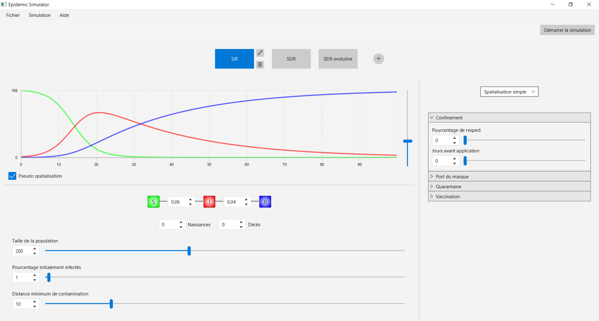
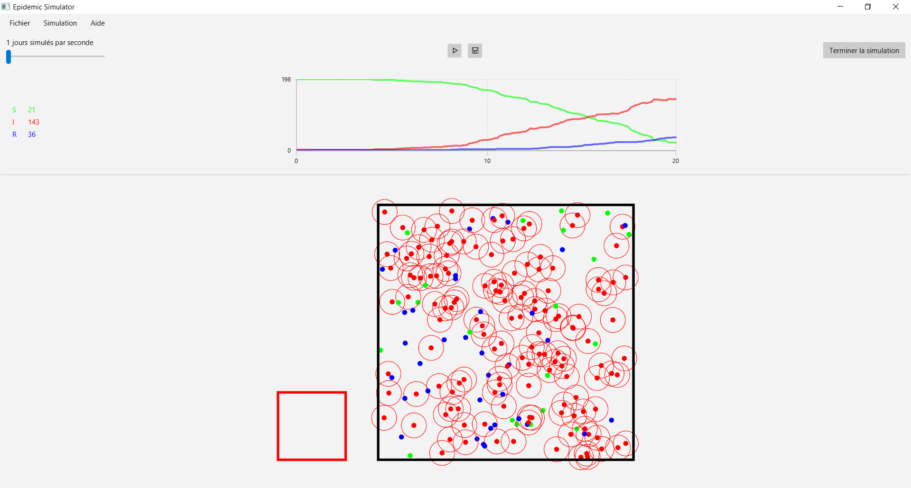

# EpiSim

Simulateur de dynamique épidémique permettant de concevoir, paramétrer et appliquer des modèles compartimentaux avec différentes politiques publiques.

| Menu principal | Simulation |
|:-------------------------:|:-------------------------:|
|||

## Exécuter à partir des sources
```
git clone https://github.com/watchtux/EpiSim.git
cd EpiSim
./gradlew run
```

## Exécuter les tests unitaires
```
./gradlew test
```

## Générer l'exécutable
```
./gradlew packageApp
```
Génère les archives: \
`app/build/app-{version}-{platform}.zip` \
`app/build/app-{version}-{platform}.tar.gz`

## Générer la documentation
```
./gradlew javadoc
```
La documentation est consultable en ouvrant dans un navigateur: \
`app/build/docs/javadoc/index.html`

## Références

https://images.math.cnrs.fr/Modelisation-d-une-epidemie-partie-1.html \
https://prajwalsouza.github.io/Experiments/Epidemic-Simulation.html
